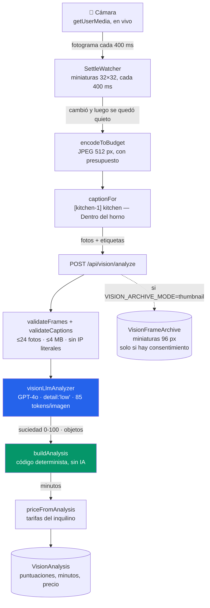
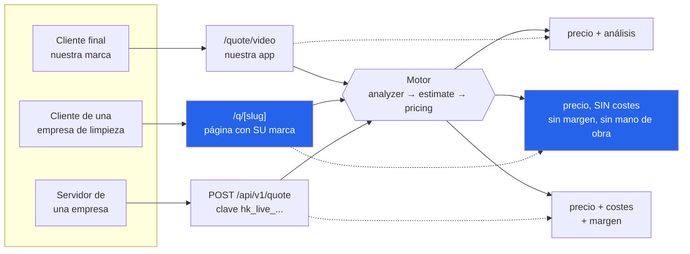
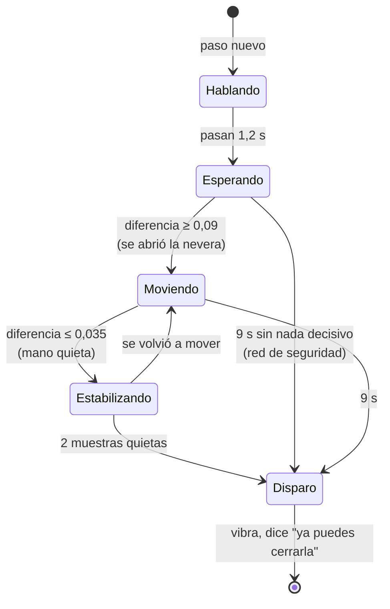
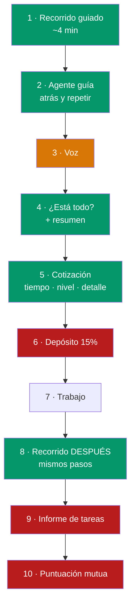
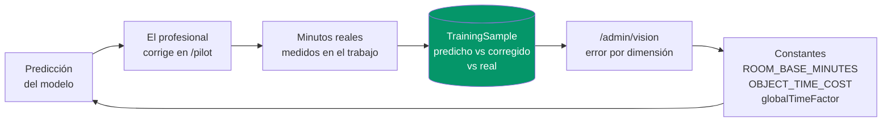
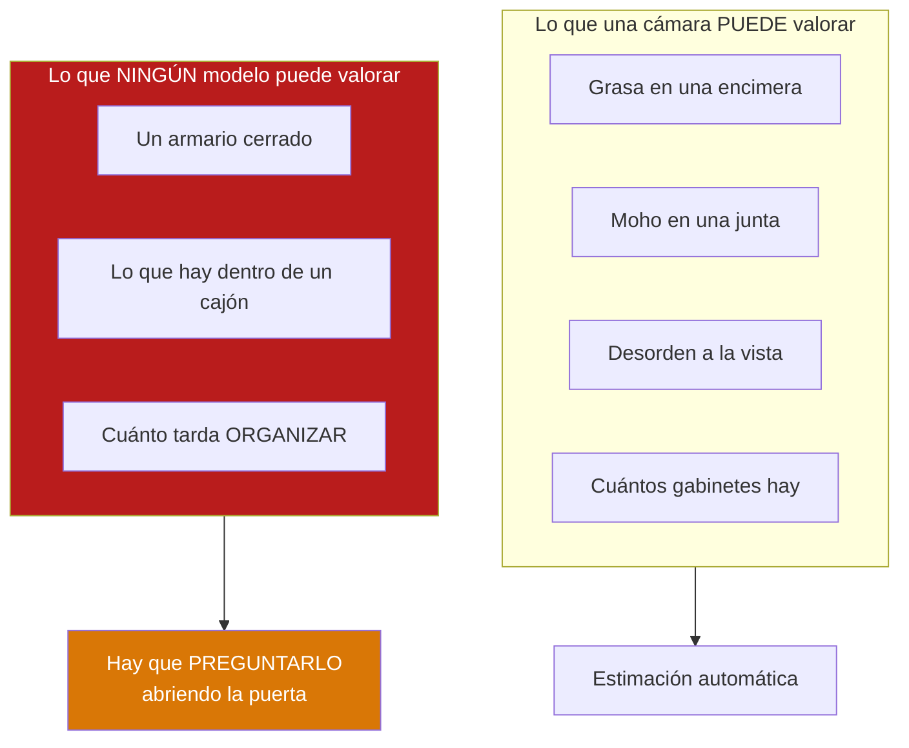

# Arquitectura

Cómo funciona el motor por dentro: qué se mueve, qué se guarda, qué se tira, y
en qué orden.

En español, como `SETUP.md`, porque quien más necesita leerlo no lee TypeScript.
Los comentarios del código siguen en inglés.

---

## 1. Flujo de datos de una cotización

Lo que pasa desde que alguien pulsa "Empezar el recorrido" hasta que ve un
precio. Lo importante de este dibujo es **dónde se queda cada cosa**: el vídeo
no existe, los fotogramas grandes son transitorios, y lo único que sobrevive es
lo pequeño.

**Las dos cajas de color son la decisión central del sistema.**

La azul (el VLM) solo **observa**: puntúa suciedad de 0 a 100 en siete
dimensiones y lista objetos. Su prompt le dice literalmente *"Do NOT estimate
time or price"*.

La verde (el estimador) es **código normal**, sin IA. Convierte esas
observaciones en minutos y dólares.

Ese corte es lo que hace que el precio sea reproducible y calibrable. Si le
preguntas el precio a un modelo, te da un número distinto cada vez y no puedes
ajustarlo con datos reales.

---

## 2. Las tres puertas

Un solo motor, tres formas de llegar a él. La diferencia que importa no es
técnica, es **qué devuelve cada una**.

`/q/[slug]` **nunca devuelve costes ni margen**. El navegador que la abre
pertenece al cliente de la empresa, no a la empresa — y esa persona no puede
estar a un panel de devtools de descubrir lo que cuesta el trabajo.

La API v1 sí los devuelve, porque quien la llama es el servidor de la propia
empresa.

Añadir una empresa nueva es **una fila en la base de datos**, no un despliegue.

---

## 3. Cuándo dispara la cámara

Lo que construimos para que nadie tenga que pulsar un botón. No es un
temporizador: es una máquina de estados sobre la diferencia entre fotogramas.

Medido contra una puerta abriéndose: **0,264 de diferencia contra un umbral de
0,09**. Quieto: **0,008 contra 0,035**. Entre tres y cuatro veces de margen a
cada lado.

No sabe qué es una nevera. No le hace falta: la app acaba de decirte que abras
una, así que el siguiente cambio grande delante del lente *es* la nevera.

La red de seguridad de 9 segundos existe porque quien sujeta el teléfono
perfectamente quieto desde el principio nunca produce el cambio que se está
esperando.

---

## 4. Ciclo de vida de un trabajo

El flujo que dibujaste a mano, con lo que existe y lo que no.

🟩 construido y verificado 🟧 parcial 🟥 no existe

**Paso 3** entiende hoy dos frases: *"listo"* y *"no tengo"*. Conversación de
verdad necesita el modelo dentro del bucle, con su latencia y su coste.

**Paso 6 es el hueco que importa.** Sin él tienes una app que da precios, no un
negocio que cobra.

---

## 5. El bucle de calibración

Esto no se ve en ninguna pantalla y es lo único que no se puede copiar.

Cada trabajo hace que el siguiente presupuesto sea mejor. El modelo de visión
es de OpenAI y cualquiera puede llamarlo mañana; **esta tabla es tuya**.

### Estado real de la calibración

Un solo trabajo medido, con cronómetro por tarea:

| | |
|---|---|
| Apartamento | 945 ft², limpio salvo polvo |
| Cocina, superficies + electrodomésticos | 17,3 min |
| Organizar un armario | 39,0 min |
| Aspiradora + mopeo | 29,0 min |
| **Total (tiempo de tarea)** | **85,3 min** |

Lo que ese dato ya cambió: la división por-encima/a-fondo, el tope de conteo
por objeto, y el armario como espacio propio.

Lo que **no** ha cambiado: ninguna constante de tiempo. Un apartamento limpio
medido una vez no distingue *"el modelo está mal"* de *"esta cocina estaba
fácil"*. `lib/vision/model.ts` lo dice en su cabecera: *treat every number here
as a hypothesis, not a fact*.

**Falta un número para desbloquear el resto:** cuánto duró la visita de puerta a
puerta. El cronómetro mide tarea; la factura es tiempo en sitio. La diferencia
es el desplazamiento, montar, mover muebles y recoger — y sin ella no se puede
saber si la base de 30 min por cocina está inflada o es correcta.

---

## 6. La frontera del producto

Lo más importante que aprendimos, y salió de dos fotos del mismo armario.

Un armario ordenado y uno que es un desastre **son la misma fotografía** con las
puertas cerradas. Ni GPT-4o, ni RF-DETR, ni YOLO, ni un modelo entrenado con un
millón de casas: la información no está en la imagen.

En el trabajo medido eso fue **el 55% de la jornada**.

Por eso existe el espacio "Armario / despensa (organizar)" en el recorrido, con
pasos que obligan a abrir la puerta.

---

## Dónde vive cada cosa

| Qué | Archivo |
|---|---|
| Guion del recorrido | `lib/capture/guide.ts` |
| Detección de disparo | `lib/capture/scene.ts` |
| Cámara y UI del recorrido | `components/capture/GuidedCapture.tsx` |
| Codificación de fotogramas | `lib/vision/frames.ts` |
| Prompt y llamada al VLM | `lib/vision/analyzer.ts` |
| Constantes de tiempo | `lib/vision/model.ts` |
| Estimador determinista | `lib/vision/estimate.ts` |
| Precios | `lib/vision/pricing.ts` |
| Rúbrica APPA | `lib/vision/appa.ts` |
| Inquilinos y claves API | `lib/tenants/store.ts` |
| Archivo de entrenamiento | `lib/vision/archive.ts` |
| Datos de calibración | `lib/vision/training.ts` |
